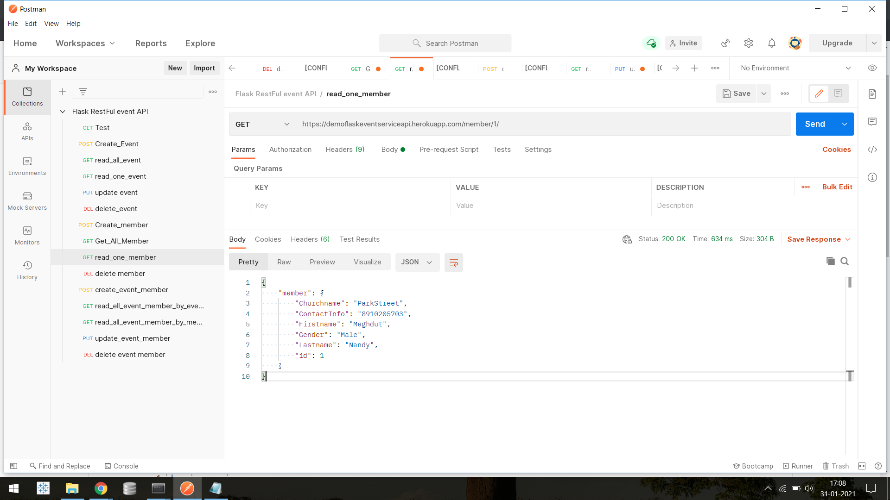

# Flask RESTful API 
###### (https://demoflaskcrudapp.herokuapp.com/member/)

### Business requirements:-

#### Technical specification
1. Backend:- Flask, SQLlite & other modules
2. Testing:- Postman
3. Deployment- Heroku

#### 1. Ability to add event
a. Should have a table called 'event'
fields:
1. id - primary unique
2. name -string (50)
3. description -string(200)
4. datefrom -	date
5. dateto -   date
6. location- string(200) 
7. imageurl-string(200)
8. status - string(20)

#### 2. Ability to add memebers
a. should have a table called 'members'
fields:		
1. id- primary unique
2. firstname- string(50)
3. lastname - string(50)
4. churchname- string(200)
5. gender-string(20)
6. contactinfo- string(50)

#### 3. Ability to add a member to and event.
a. should have a table called 'event_members'
fields:
1. id- primary unique
2. event_id-  integer.
3. member_id -integer.
4. status - string(50)
